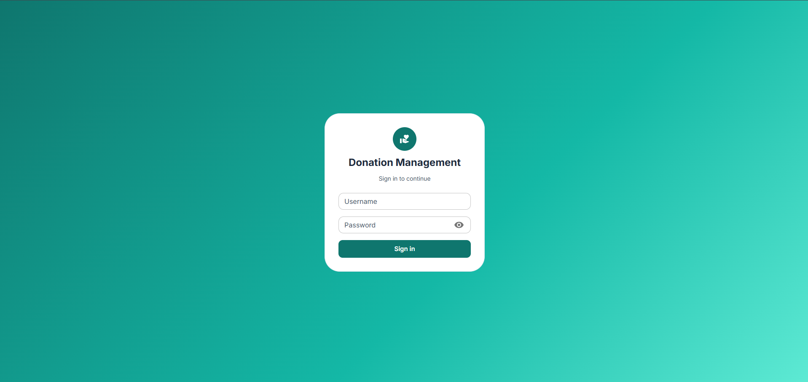
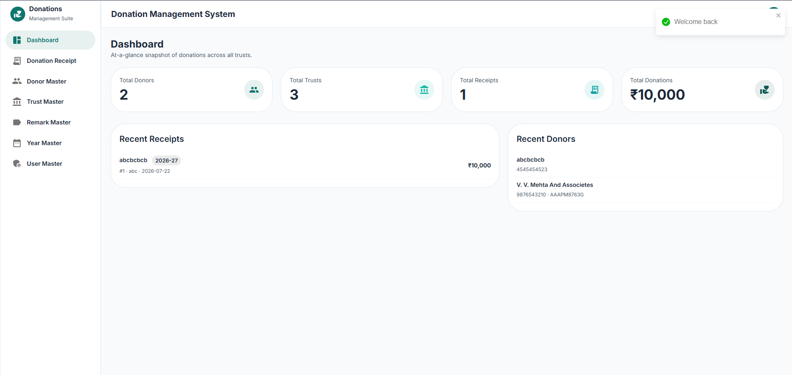
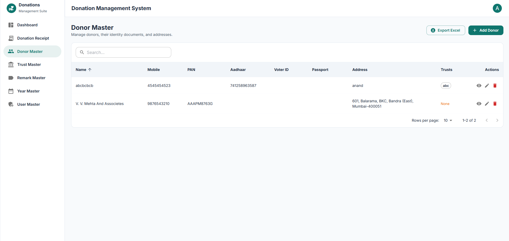
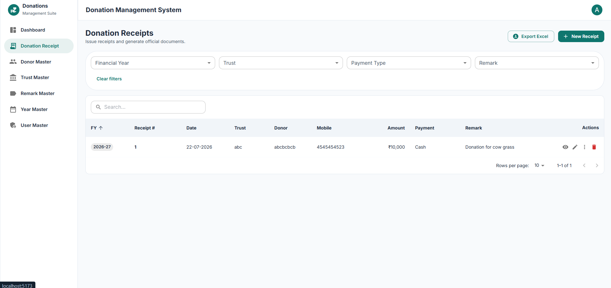
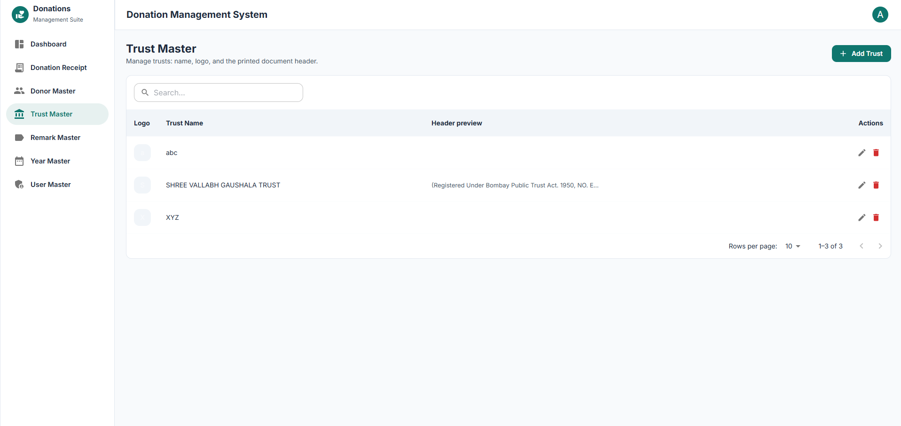
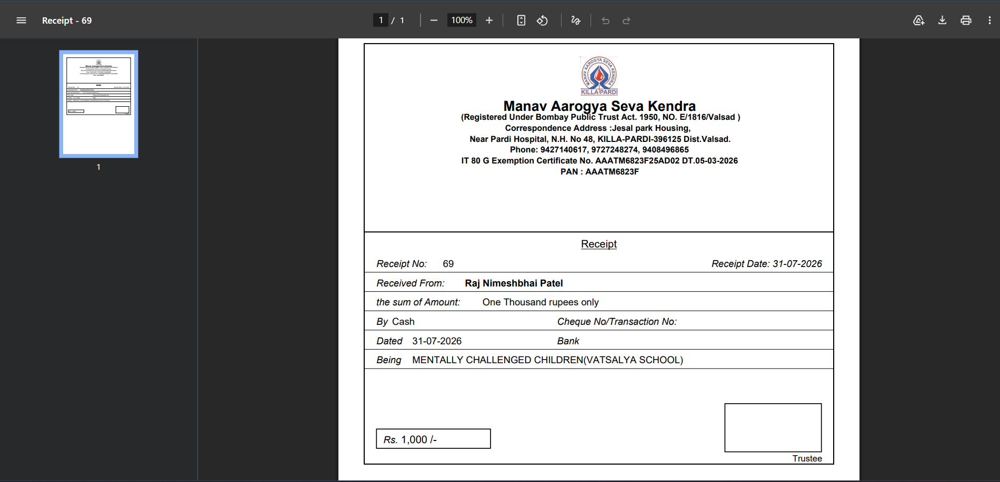

# Donation Management System

A production-ready donation management system built for **SHREE VALLABH GAUSHALA TRUST**
and similar trusts. It handles donors, trusts, remarks, and donation receipts, and
generates official PDF receipts, covering letters, and thanks-letter bundles — with the
original PDF templates preserved verbatim and only dynamic values injected at render time.

---

## Screenshots

> Drop your screenshot images into a `screenshots/` folder in the repo root and they will
> render here.

| Login | Dashboard |
| ----- | --------- |
|  |  |

| Donor Master | Donation Receipt |
| ------------ | ---------------- |
|  |  |

| Trust Master | Generated PDF Receipt |
| ------------ | --------------------- |
|  |  |

---

## Features

- **Dashboard** — totals and recent activity at a glance.
- **Donor Master** — full CRUD for donors, plus document upload/download and Excel export.
- **Trust Master** — manage multiple trusts, each with its own logo.
- **Remark Master** — reusable remark presets.
- **Donation Receipts** — full CRUD with automatic per-`(Financial Year, Trust)` numbering
  that restarts at **1** for every new FY/Trust pair, enforced server-side via an async mutex.
- **PDF Engine** — coordinate-calibrated renderers produce the receipt, donor's covering
  letter, and 3-page thanks-letter bundle on blank A4 pages using `pdf-lib`.
- **Authentication** — JWT-based login (default `admin / admin123`).
- **Soft deletion** — records are flagged via `is_status` rather than hard-deleted.
- **Pluggable storage** — services depend only on repository interfaces, so the default
  JSON store can be swapped for PostgreSQL by setting `REPO_DRIVER=postgres`.

---

## Tech Stack

**Frontend**
- React 18 + Vite 5
- Material UI (MUI) 5 + Emotion
- TanStack Query (React Query)
- React Hook Form
- React Router
- Framer Motion
- Axios, Day.js, ExcelJS, React-Toastify

**Backend**
- Node.js + Express 4
- JWT (`jsonwebtoken`) + `bcryptjs` for auth
- Multer for file uploads, Sharp for image processing
- `pdf-lib` for PDF generation
- `async-mutex` for safe receipt numbering
- JSON file repositories by default; PostgreSQL (`pg`) driver ready to wire in

**Tooling**
- `concurrently` (one-command dev launcher)
- `nodemon` (backend live-reload)

---

## Installation

**Prerequisites:** Node.js 18+ and npm.

### 1. Clone the repository

```bash
git clone <your-repo-url>
cd Vallabh_ashram_Donation_claude
```

### 2. Install dependencies (root + backend + frontend)

```bash
npm run install:all
```

### 3. Seed initial data (one-time)

```bash
npm run seed
```

This creates the default trust, donor, remarks, and admin login.

### 4. Run the app (backend + frontend together)

```bash
npm run dev
```

- Backend → http://localhost:4000
- Frontend → http://localhost:5173

Open the frontend URL and sign in with:

```
username: admin
password: admin123
```

### Useful scripts

| Command             | What it does                                  |
| ------------------- | --------------------------------------------- |
| `npm run dev`       | Runs backend + frontend with live-reload      |
| `npm run install:all` | Installs root, backend, and frontend deps   |
| `npm run seed`      | Seeds default trust, donor, remarks, admin    |
| `npm run migrate`   | Runs backend database migrations              |
| `npm run build`     | Builds the frontend for production            |
